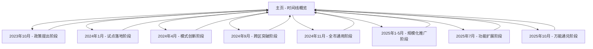

# 广州房票政策时间线展示网站 - 产品需求文档

## 1. 产品概述
本项目旨在将广州房票政策时间线内容制作成一个美观、易读的展示网站，完整呈现从2023年10月到2025年10月的政策发展历程。网站将以时间线的形式展示各个阶段的关键事件，方便用户了解广州房票政策的演进过程，适合分享给他人查阅。

## 2. 核心功能

### 2.1 用户角色
本网站为纯展示型网站，无需用户注册，所有访问者均可直接浏览全部内容。

### 2.2 功能模块
网站包含以下主要页面：
1. **主页**：时间线展示、导航菜单、页面概述
2. **详细阶段页面**：各个政策阶段的详细信息展示

### 2.3 页面详情

| 页面名称 | 模块名称 | 功能描述 |
|---------|---------|---------|
| 主页 | 页面标题 | 显示网站标题"广州房票政策时间线（2023-2025）" |
| 主页 | 时间线导航 | 展示8个主要阶段的时间节点，支持点击跳转 |
| 主页 | 时间线可视化 | 垂直时间线布局，展示关键时间点和事件概要 |
| 主页 | 阶段概览 | 每个阶段的关键词和核心事件简述 |
| 详细页面 | 阶段详情 | 展示具体阶段的详细事件、时间、关键词 |
| 详细页面 | 事件列表 | 按时间顺序展示该阶段的所有重要事件 |
| 详细页面 | 返回导航 | 返回主页的导航按钮 |

## 3. 核心流程
用户访问网站后，首先看到主页的时间线概览，可以通过以下方式浏览内容：
1. 在主页浏览完整时间线概览
2. 点击感兴趣的阶段查看详细信息
3. 在详细页面查看具体事件和政策内容
4. 通过导航返回主页继续浏览其他阶段

## 4. 用户界面设计

### 4.1 设计风格
- **主色调**：深蓝色（#1e3a8a）和浅蓝色（#3b82f6），体现政策的专业性和权威性
- **辅助色**：橙色（#f59e0b）用于突出重要时间节点，绿色（#10b981）用于成功状态
- **按钮样式**：圆角矩形按钮，带有悬停效果和阴影
- **字体**：中文使用"Microsoft YaHei"，英文使用"Arial"，标题字体大小18-24px，正文14-16px
- **布局风格**：现代化卡片式布局，垂直时间线设计，响应式网格系统
- **图标样式**：使用简洁的线性图标，配合时间线节点使用圆形标记

### 4.2 页面设计概览

| 页面名称 | 模块名称 | UI元素 |
|---------|---------|--------|
| 主页 | 页面头部 | 深蓝色背景，白色标题文字，居中布局 |
| 主页 | 时间线区域 | 垂直时间线，左侧时间标记，右侧内容卡片，交替布局 |
| 主页 | 阶段卡片 | 白色背景卡片，圆角阴影，橙色时间标签，蓝色关键词标签 |
| 主页 | 导航按钮 | 蓝色背景，白色文字，圆角设计，悬停变色效果 |
| 详细页面 | 内容区域 | 白色背景，深灰色文字，充